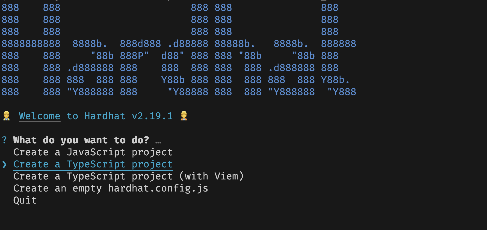

## 1. 创建项目
创建项目
```shell
mkdir carservice-contract
cd carservice-contract
yarn init -y
yarn add hardhat
yarn hardhat init
```

选择创建typescript工程，之后根据提示选择即可，默认全部为y


项目路径介绍


## 2. 编写合约
### 1. User合约
添加依赖
```bash
# 这里使用openzeppelin合约库里面的ownable,作为权限管理，集成Ownable会在contructor中将msg.sender作为owner。使用哪个版本是要看编译的solidity的版本而定的
# https://docs.openzeppelin.com/contracts/4.x/access-control
yarn add @openzeppelin/contracts@^4.9.3
```
编写 user 合约

```Solidity
// SPDX-License-Identifier: MIT
pragma solidity ^0.8.19;

import "@openzeppelin/contracts/access/AccessControl.sol";

error Error_UserAlreadyExists();
error Error_UserInfoParamsInvalid();
error Error_UserNotExists();


contract User is AccessControl {

    /// @notice 用户结构体
    struct UserEntity {
        uint256 id; // 用户id
        uint256 phone; // 用户电话
        uint256 score; // 用户积分
    }

    /// manager role
    bytes32 public constant MANAGER = keccak256("MANAGER");

    /// @notice 用户信息相关的mapping
    /// 用户id => 用户信息
    mapping (uint256 => UserEntity) private userInfo;

    /// 用户创建的事件
    /// @param userId 用户的id
    /// @param user 用户信息
    event UserCreated(uint256 indexed userId, UserEntity user);

    /// 用户更新的事件
    /// @param userId 用户的id
    /// @param user 用户信息
    event UserUpdated(uint256 indexed userId, UserEntity user);

    constructor() {
        // 给deployer授权 MANAGER 角色权限
        _grantRole(MANAGER, msg.sender);
        // 给deployer授权 DEFAULT_ADMIN_ROLE 角色权限
        _grantRole(DEFAULT_ADMIN_ROLE, msg.sender);
    }

    /// 创建用户
    /// @param _user 用户信息
    function CreateUser(UserEntity memory _user) onlyRole(MANAGER) external {
        // 需要输入的_user的信息是正确的, 用户id和phone必须不能为0
        if (_user.id == 0 || _user.phone == 0) {
            revert Error_UserInfoParamsInvalid();
        }

        // 需要当前用户没有创建,这里使用自定义error来节省gas费
        // 这里就不考虑phone的映射关系和唯一性了，也可以再添加一个映射
        if (userInfo[_user.id].id > 0) {
            revert Error_UserAlreadyExists();
        }

        // 添加用户信息
        userInfo[_user.id] = _user;
        
        // 发送消息到网络，即写入日志
        emit UserCreated(_user.id, _user);
    }

    /// 更新用户信息
    /// @param _id 用户的id
    /// @param _phone 用户的手机
    /// @param _score 用户的积分
    function UpdateUser(uint256 _id, uint256 _phone, uint256 _score) onlyRole(MANAGER) external {
        if (userInfo[_id].id == 0) {
            revert Error_UserNotExists();
        }
        userInfo[_id].phone = _phone;
        userInfo[_id].score = _score;
        emit UserUpdated(_id, UserEntity(_id, _phone, _score));
    }

    /// 充值score
    /// @param _id 用户的id
    /// @param _score 用户的积分
    function ChargeScore(uint256 _id, uint256 _score) onlyRole(MANAGER) external{
        UserEntity memory _userInfo = userInfo[_id];
        if (_userInfo.id == 0) {
            revert Error_UserNotExists();
        }
        uint256 score = _userInfo.score + _score;
        userInfo[_id].score = score;
        emit UserUpdated(_id, UserEntity(_id, _userInfo.phone, score));
    }


    /// 支付score
    /// @param _id 用户的id
    /// @param _score 用户的积分
    function PayScore(uint256 _id, uint256 _score) onlyRole(MANAGER) external{
        UserEntity memory _userInfo = userInfo[_id];
        if (_userInfo.id == 0) {
            revert Error_UserNotExists();
        }
        uint256 score = _userInfo.score - _score;
        userInfo[_id].score = score;
        emit UserUpdated(_id, UserEntity(_id, _userInfo.phone, score));
    }


    /// 根据用户id获取用户信息
    /// @param _userId 用户id
    function GetUser(uint256 _userId) external view returns (UserEntity memory user) {
        if (userInfo[_userId].id == 0) {
            revert Error_UserNotExists();
        }
        return userInfo[_userId];
    }
}
```

编写 order 合约
```Solidity
// SPDX-License-Identifier: MIT
pragma solidity ^0.8.19;

import "@openzeppelin/contracts/access/Ownable.sol";
import "@openzeppelin/contracts/utils/Counters.sol";
import "./interface/IUser.sol";

error Error_OrderAlreadyExists();
error Error_OrderNotExists();
error Error_OrderAlreadyPayed();
error Error_OrderUserNotEnoughScoreToPay();

contract Order is Ownable {

    // 使用library里面的自增
    using Counters for Counters.Counter;

    enum OrderType {
        Highway, // 0
        Charge, // 1
        Park // 2
    }

    struct OrderEntity {
        uint256 id;
        uint256 orderID;
        string orderSn;
        OrderType orderType;
        uint256 startAt;
        uint256 endAt;
        uint256 userID;
        uint256 fee;
        uint256 uniteCount;
        bool isPayed;
        uint256 blockHeight;
        uint256 blockTimestamp;
        string startPosition;
        string endPosition;
    }

    /// @dev 用户的所有order
    /// orderId => OrderEntity
    mapping (uint256 => OrderEntity) orders;

    // 当前自增id
    Counters.Counter public currentID;

    /// @dev user contract
    IUser user;


    /// order创建的事件
    /// @param orderID 用户的id
    /// @param order 用户信息
    event OrderCreated(uint256 indexed orderID, OrderEntity order);

    /// order更新的事件
    /// @param orderID 用户的id
    /// @param order 用户信息
    event OrderUpdated(uint256 indexed orderID, OrderEntity order);

    /// order支付的事件
    /// @param orderID 用户的id
    /// @param order 用户信息
    event OrderPayed(uint256 indexed orderID, OrderEntity order);

    constructor(address _user) {
        user = IUser(_user);
        // id从1 开始
        currentID.increment();
    }

    // create order
    function CreateOrder(
        uint256 _orderID,
        string calldata _orderSn,
        OrderType _orderType,
        uint256 _startAt,
        uint256 _endAt,
        uint256 _userID,
        uint256 _fee,
        uint256 _uniteCount,
        bool _isPayed,
        string calldata _startPosition,
        string calldata _endPosition) onlyOwner external  {

        if (orders[_orderID].id > 0) {
            revert Error_OrderAlreadyExists();
        }

        // 查看user是否存在
        user.GetUser(_userID);

        uint256 _currentID = currentID.current();
        OrderEntity memory _order = OrderEntity(
            _currentID, 
            _orderID,
            _orderSn,
            _orderType,
            _startAt,
            _endAt,
            _userID,
            _fee,
            _uniteCount,
            _isPayed,
            block.number,
            block.timestamp,
            _startPosition,
            _endPosition);
        orders[_orderID] = _order;
        // 记得增加1
        currentID.increment();

        // emit
        emit OrderCreated(_orderID, _order);
    }

    // update order
    function UpdateOrder(
        uint256 _orderID,
        string calldata _orderSn,
        OrderType _orderType,
        uint256 _startAt,
        uint256 _endAt,
        uint256 _userID,
        uint256 _fee,
        uint256 _uniteCount,
        bool _isPayed,
        string calldata _startPosition,
        string calldata _endPosition) onlyOwner external  {
        
        // 存在才能更新，不存在就报错
        if (orders[_orderID].id == 0) {
            revert Error_OrderNotExists();
        }
        
        OrderEntity memory _order = orders[_orderID];

        _order.orderSn = _orderSn;
        _order.orderType = _orderType;
        _order.startAt = _startAt;
        _order.endAt = _endAt;
        _order.userID = _userID;
        _order.fee = _fee;
        _order.uniteCount = _uniteCount;
        _order.startPosition = _startPosition;
        _order.endPosition = _endPosition;
        _order.isPayed = _isPayed;

        // 写回去
        orders[_orderID] = _order;

        // emit
        emit OrderUpdated(_orderID, _order);
    }

    // pay order
    function PayOrder(uint256 _orderID, uint256 _userID) onlyOwner external  {
        // order should exists
        // 存在才能更新，不存在就报错
        OrderEntity memory _order = orders[_orderID];
        if (_order.id == 0) {
            revert Error_OrderNotExists();
        }

        if (_order.isPayed) {
            revert Error_OrderAlreadyPayed();
        }

        // TODO: 是否需要userID和order里面的userID一致，看是否支持别人帮忙支付。这里不做判断

        // decimal 都是 100，如果是highway类型的只考虑fee即可
        uint256 price = _order.fee * _order.uniteCount / 100;
        if (_order.orderType == OrderType.Highway) {
            price = _order.fee;
        }

        // 通过userid获取userinfo
        IUser.UserEntity memory _userInfo = user.GetUser(_userID);
        // 其实这个不判断也行，直接减去price，如果小于0就会overflow
        if (_userInfo.score < price) {
            revert Error_OrderUserNotEnoughScoreToPay();
        }

        // 由于可能会存在Reentrancy攻击，这里先修改状态，然后再转账,不过这里不存在作恶的基础，因为重复支付对user没有任何好处，不考虑重入问题也可以。
        // 更新payed状态
        _order.isPayed = true;
        // 写回去
        orders[_orderID] = _order;

        // TODO: 是否使用score支付,会打折，这个看实际需求，实现方式很多，可以这里修改，也可以，充值积分的时候赠送积分，都等于变相打折。
        user.PayScore(_userInfo.id, price);

        emit OrderPayed(_orderID, _order);
    }


    function GetOrder(uint256 _orderID) external view returns (OrderEntity memory) {
        
        OrderEntity memory _order = orders[_orderID];
        if (_order.id == 0) {
            revert Error_OrderNotExists();
        }
        return _order;
    }
}
```

然后根据实际情况编写测试代码

测试代码
```shell
# 测试全部test路径下的代码
yarn hardhat test
# 测试某一个文件
yarn hardhat test test/Order.test.ts
# 测试某一个测试方法
yarn hardhat test test/Order.test.ts --grep "It should have manager role granted properly"
# 如果部署在某一个evm公链上，可以加上 --network xxxx来指定在对应的链上执行测试，network则需要再hardhat.config.ts中配置。

```

由于这里需要部署到联盟链，交互在后端，部署脚本就用golang实现，在golang中引入bin
```shell
# 生成bin到build路径下，然后拷贝到golang后端的contracts下即可。
./build.sh
```

# Sample Hardhat Project

This project demonstrates a basic Hardhat use case. It comes with a sample contract, a test for that contract, and a script that deploys that contract.

Try running some of the following tasks:

```shell
npx hardhat help
npx hardhat test
REPORT_GAS=true npx hardhat test
npx hardhat node
npx hardhat run scripts/deploy.ts
```
